author: Tamimi
summary:
id: nagios
tags: iguide
categories: Nagios, Integration
environments: Web
status: Published
feedback link: https://github.com/SolaceDev/solace-dev-codelabs/blob/master/markdown/integrations/nagios

# Integration Guide: Nagios Monitoring Toolset

## Overview
Duration: 0:05:00

Nagios (previously NetSaint) is an open-source monitoring and alerting system that’s widely used to monitor systems, networks and infrastructure. Objects monitored by Nagios are split into two categories: hosts (physical machines) and services (particular functionalities). Nagios does not perform any host or service checks on its own and relies on plugins to do this. This makes it a very modular and flexible solution. 

Extending this "monitoring by plugin" paradigm of Nagios, Solace provides a set of plugin scripts that perform the event broker and VPN monitoring. Following Nagios convention, the plugins add host (event broker) and service (VPN resources) categories.

Nagiograph parses output and performance data from Nagios plugins and generates graphs and HTML pages for reporting. Nagiograph stores data in RRD (Round Robin Database) files as time series data. RRDTool is an Open source parser that integrates into Shell scripts, Perl, Python, Ruby, Tcl, etc. 
The following picture illustrates different components and high level data flow.

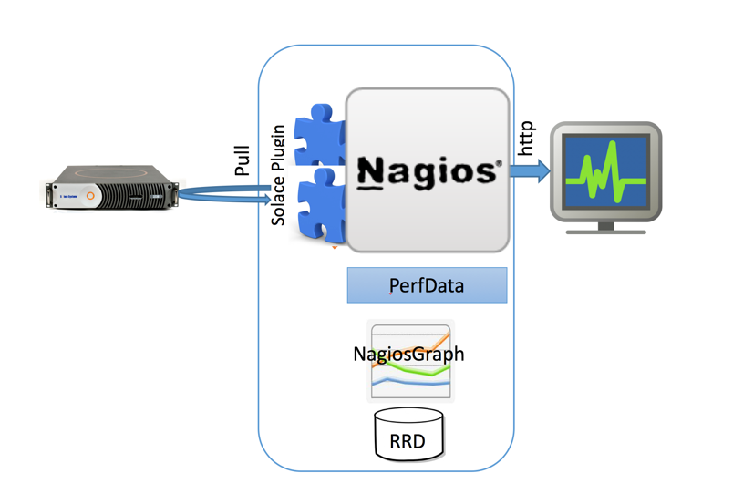

### Audience

This document is primarily intended for Solace administrators and operations teams responsible for setting up and monitoring infrastructure.

### Related Documentation

These documents contain information related to the feature defined in this document:

* [Solace Developer Portal](http://solace.dev) 
* [Solace Feature Guide](https://docs.solace.com/Features/Core-Concepts.htm) 
* [Solace Command Line Interface Reference](https://docs.solace.com/Solace-CLI/Using-Solace-CLI.htm) 

### Prerequisites

#### Requirements

* The installation and setup steps require that you have root access on the CentOS server 
* The installation and setup steps also require that you have CLI access to the Solace Event Broker
* The Solace Event Broker should be reachable over network from the CentOS server running Nagios

#### Assumptions

* This document is based on SolOS version 7.1.1, though earier versions (such as SolOS 6.2) should work without any changes.
* Setup steps in this guide were tested on CentOS 6.3 CentOS 7.0 (both 64 Bit Minimal install).  Command syntax and file locations would vary on other flavors of Linux.

## Get Solace Messaging
Duration: 0:10:00


This tutorial requires access to Solace PubSub+ event broker and requires that you know several connectivity properties about your event broker. Specifically you need to know the following:

<table>
  <tr>
    <td>Resource</td>
    <td>Value</td>
    <td>Description</td>
  </tr>
  <tr>
    <td>Host</td>
    <td>String</td>
    <td>This is the address clients use when connecting to the event broker to send and receive messages. (Format: <code>DNS_NAME:Port</code> or <code>IP:Port</code>)</td>
  </tr>
  <tr>
    <td>Message VPN</td>
    <td>String</td>
    <td>The event broker Message VPN that this client should connect to. </td>
  </tr>
  <tr>
    <td>Client Username</td>
    <td>String</td>
    <td>The client username. (See Notes below)</td>
  </tr>
  <tr>
    <td>Client Password</td>
    <td>String</td>
    <td>The client password. (See Notes below)</td>
  </tr>
</table>

There are several ways you can get access to Solace messaging and find these required properties.

### Option 1: Use Solace Cloud

* Follow [these instructions](https://solace.com/products/platform/cloud/) to quickly spin up a cloud-based Solace messaging service for your applications.
* The messaging connectivity information is found in the service details in the connectivity tab (shown below). You will need:
    * Host:Port (use the JMS URI)
    * Message VPN
    * Client Username
    * Client Password


### Option 2: Start a Solace PubSub+ Software Event Broker

* Follow [these instructions](https://solace.com/downloads/) to start the software event broker in leading Clouds, Container Platforms or Hypervisors. The tutorials outline where to download and how to install the Solace software event broker.
* The messaging connectivity information are the following:
    * Host: \<public_ip> (IP address assigned to the software event broker in tutorial instructions)
    * Message VPN: default
    * Client Username: sampleUser (can be any value)
    * Client Password: samplePassword (can be any value)

    Note: By default, the Solace software event broker "default" message VPN has authentication disabled.

### Option 3: Get access to a Solace PubSub+ appliance

* Contact your Solace PubSub+ appliance administrators and obtain the following:
    * A Solace Message-VPN where you can produce and consume direct and persistent messages
    * The host name or IP address of the appliance hosting your Message-VPN
    * A username and password to access the appliance


## Nagios Setup
Duration: 0:15:00

### Prerequisites

A working Nagios installatin requires the following packages/tools

* Httpd (Apache)
* RRDTool
* GD Grahics library and related Perl modules
* NRPE (Nagios Remote Plugin Executor)

```
# yum install -y httpd php gcc glibc glibc-common gd gd-devel make net-snmp wget
# yum install rrdtool perl-rrdtool perl-GD
# yum install perl-CGI\* perl-Time-HiRes
```

### Enabling EPEL

The steps for enabling Extra Packge Repositor (EPEL) are release specific and please check for your install. 

#### CentOS 7

```
# wget http://dl.fedoraproject.org/pub/epel/7/x86_64/e/epel-release-7-5.noarch.rpm
# rpm -ivh epel-release-7-5.noarch.rpm
```

#### CentOS 6.3

```
rpm -Uvh http://dl.fedoraproject.org/pub/epel/6/x86_64/epel-release-6-8.noarch.rpm
rpm -Uvh http://rpms.famillecollet.com/enterprise/remi-release-6.rpm
```

### Installation

```
yum -y install nagios nagios-plugins-all nagios-plugins-nrpe nrpe 
```

### Post install setup

#### HTTP Setup

Setting up an HTTP server (such as Apache) is beyond the scope of this document. Pl refer to the documentation for your HTTP server.  Nagios setup should have dropped the required config file to setup URL Aliases. The file is typically <OptioalConfigDir>/nagios.cfg (Eg: /etc/httpd/conf.d/nagios.cfg). 
If Checking Webadmin below doesn’t work, check the httpd config and logs to see if this file was processed.

#### Firewall setup

Firewall setup and making changes to existing firewall configuration is again beyond the scope of this document. For eg, if you are using iptables (default firewall on CentOS), then you may need to explicitly allow incoming connection on required ports (Refer Additional Topics Section)

#### Nagios Admin User

Create password for nagiosadmin user for web access.

```
# htpasswd –c /etc/nagios/passwd nagiosadmin
# systemctl restart httpd
# systemctl restart nagios
```

### Verification

Point the webbrowser to `http://your-server-ip[:port]/nagios`
Login with the username nagiosadmin and the password above step (htpassword command).

Sample page is shown below


## Nagiosgraph Setup
Duration: 0:10:00

### Prerequisites

NagiosGraph installation requires the following packages/tools

* RRDTool and related Perl modules
* GD Graphics Library and related Perl modules

```
# yum install rrdtool perl-rrdtool perl-GD
```

### Installation

```
# cd /opt/pkg # or path of your choice
# wget http://downloads.sourceforge.net/project/nagiosgraph/nagiosgraph/1.5.2/nagiosgraph-1.5.2.tar.gzwget 

# tar xvzf nagiosgraph-1.5.2.tar.gz
# cd nagiosgraph-1.5.2
# ./install.pl --check-prereq
...

# ./install.pl --layout standalone --prefix /usr/local/nagiosgraph --nagios-perfdata-file=/var/log/nagios/perfdata.log --var-dir=/var/nagios/
... 
Continue with this configuration? [y] y
...
```

### Post install setup

Run the Solace provided Nagios that modify the Config files appropriately. Edit the script and change the file paths if necessary at the top of the script. 
Running setup_nagiossolace can be deferred until Solace plugins are installed (in following section).If Solace specific tools are not in place or the Config files not setup, corresponding steps will be skipped. 

```
# ./setup_nagiossolace 

Checking required files ...
...

Setting up config files ... 
...
Restarting services ...
   nagios :
nagios (pid 4155) is running...
   httpd :
...
```

#### Restarting Services

```
# chkconfig httpd on && chkconfig nagios on
# systemctl restart httpd
# systemctl restart nagios
```

### Verification

The above script adds another host by name "localhost-gr" with graphics enabled that can be used to test the Nagiosgraph install. Sample page is shown below.

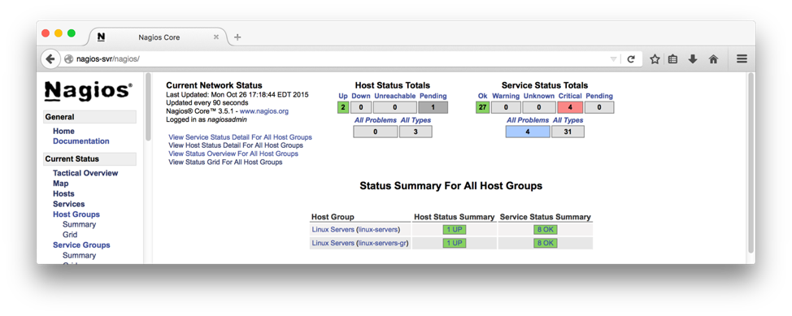


Clicking on the graph symbols to the right of service name brings up a graph with various time bracket. A sample graph for one of the services (HTTP) for a day is shown below:

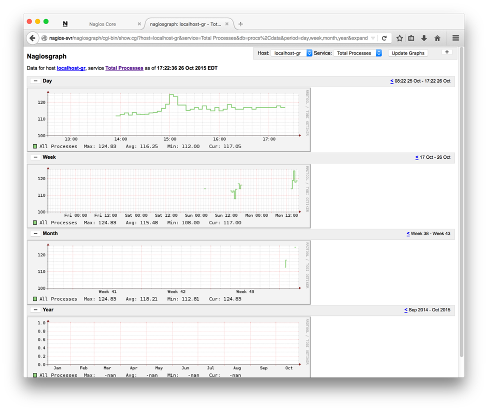

## Solace Nagios Plugin Setup
Duration: 0:15:00

### Prerequisites

Solace Nagios plugin requirs the following tools / packages

* Perl modules to handle XML & Nagios
* Solace pluging package

```
# yum install perl-CPAN perl-XML-LibXML perl-Nagios-Plugin

# perl -MCPAN -e shell
##
cpan> install Nagios::Plugin
cpan> install Nagios::Plugin::DieNicely
cpan> install LWP::UserAgent
cpan> install Nagios::Config
cpan> exit
```

### Installation

#### Create Sample file

Create a sample event broker Config. This file used by the setup script (below) to create commands for this config. This step can also be repeated for other brokers/vpns using the command mk_nagiossolacecfg script. 

```
# cat cfg/solace-vmr2.cfg 
# change the your_XXX in this file before running setup_nagiossolace script
HOSTNAME=solace-vmr2
HOSTIP=192.168.56.102
HOSTPORT=8080
USERNAME=admin
PASSWORD=*****
VPNNAME=vpn1
VPN_BRIDGENAME=bridge_vpn1_to_2
```

#### Setup Plugin

Run the setup_nagiossolace script. This will setup both Nagiosgraph and the solace plugin. If Nagisgraph is already setup, the related steps will be skipped. 

```
# ./mk_nagiossolacecfg cfg/solace-vmr2.cfg 

Generating Nagios config for Solace Event Broker ...
   Using cfgfile cfg/solace-vmr2.cfg
   Using template file cfg/solace-templaterouter-no_bi_bridge.cfg
Generating  config ...
   /etc/nagios/objects/solace-solace-vmr2.cfg :
Setting up config files ... 
   /etc/nagios/nagios.cfg :
```

### Verification

If the sample event broker info is successfully configured, a host entry matching the event broker hostname from Config file will be added to the web page. 

A sample entry is shown below:

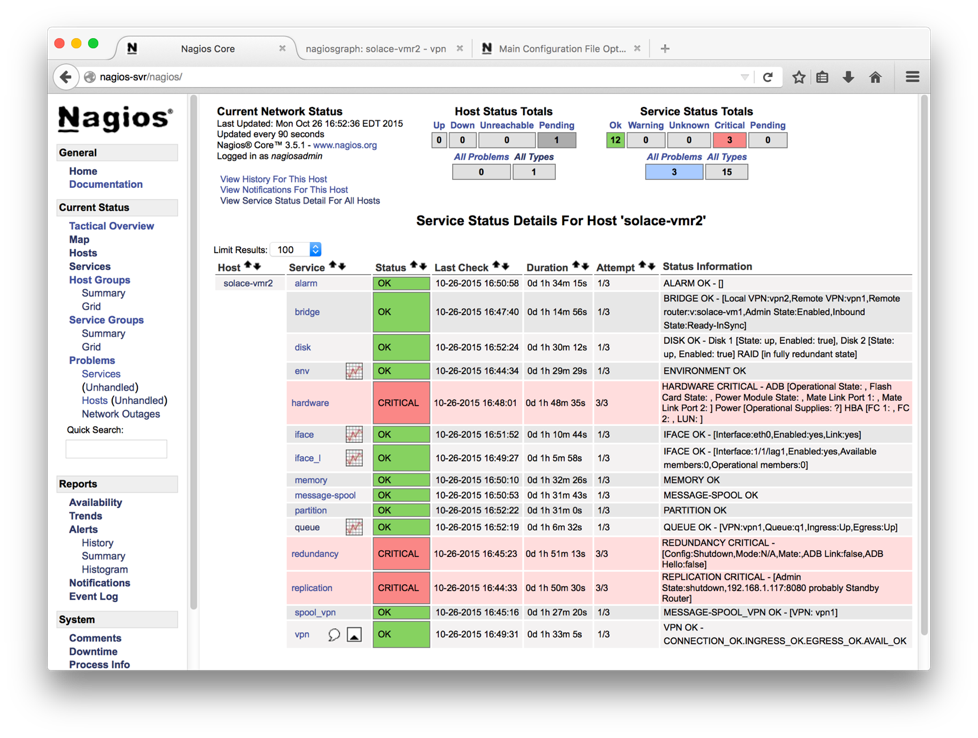

Clicking on the graph icon to the right of the service name brings up the graphs with options. A sample graph is shown below.

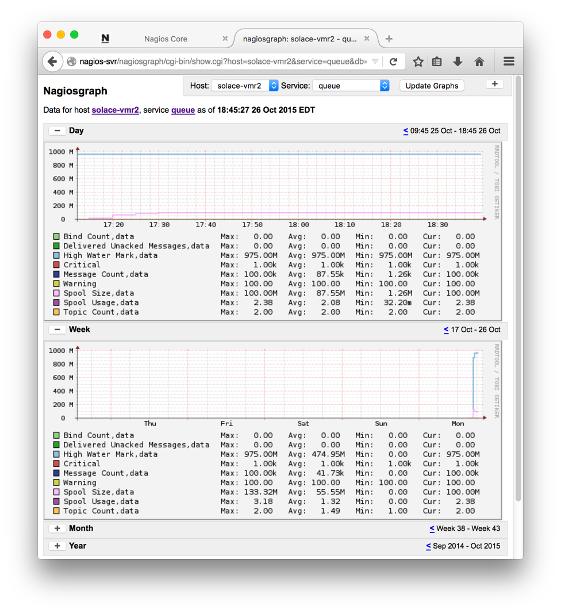

## NSCA Setup
Duration: 0:10:00

NSCA (Nagios Service check Acceptor) is a daemon that can accept the requests on behalf of Nagios and update the external command file. Nagios would periodically check the external command file and process them.  This "passive check" is a way to push the external status and alerts into Nagios instead of Nagios pulling the status for configured hosts and services "actively".  The passive check offers more fine grained intervals and useful for near real time status updates and alerting. 


### Installation

Step 1. Download  NSCA plugin from the Nagios Exchange. The current version as of this writing is 2.9.1 ([http://prdownloads.sourceforge.net/sourceforge/nagios/nsca-2.9.1.tar.gz](http://prdownloads.sourceforge.net/sourceforge/nagios/nsca-2.9.1.tar.gz))

Step 2. Untar and follow install instructions in the package. 

```
$ cd /opt/pkg (or directory of your choice)
$ wget http://prdownloads.sourceforge.net/sourceforge/nagios/nsca-2.9.1.tar.gz (check the nsca site for latest package name and replace)
$ tar xvzf nsca-2.9.1.tar.gz (adjust version accordingly)
$ cd /opt/pkg/nsca-2.9.1/ (adjust version accordingly)
$ ./configure
*** Configuration summary for nsca 2.9.1 01-27-2012 ***:

 General Options:
 -------------------------
 NSCA port:  5667
 NSCA user:  nagios
 NSCA group: nagios

$ make all
```

### Post install setup

Step 1. Run ./setup_nsca script with source and target directories. The default target dir is /usr/local/nsca

This will generate required Config file and setup nsca as service.

NOTE: Check Config file /usr/local/nsca/cfg/nsca.cfg and make changes if required, esp to host IP.

```
# ./setup_nsca -s /opt/pkg/nsca-2.9.1/
   srcdir /opt/pkg/nsca-2.9.1/ ok
   target dir /usr/local/nsca ok
Checking ...
…
Installing ...
…
Creating service  ...
Installation complete!
```

Step 2. Start service

Now that the component is installed, start it up.

```
# systemctl restart nsca
```

### Verification 

Use send_alert or send_ngalert.pl wrapper to send an alert to remote host and test. Use send_alert –h / send_ngalert.pl –h for usage info.

#### Sending Host Alert

```
# ./send_ngalert.pl -n vmr3 -c OK -i Status=UP
Reading server config : /usr/local/nsca/cfg/nsca_server.cfg
starting send_nsca client ...
sending host command: vmr3:0: - [Status=UP] 
Nov  9 15:40:30 centos7-vm nsca[9888]: Handling the connection...
1 data packet(s) sent to host successfully.

/var/log/messages Logs
Nov  9 15:40:30 centos7-vm nsca[9888]: Time difference in packet: 0 seconds for host vmr3
Nov  9 15:40:30 centos7-vm nsca[9888]: HOST CHECK -> Host Name: 'vmr3', Return Code: '0', Output: ' - [Status=UP]'
Nov  9 15:40:30 centos7-vm nsca[9888]: Attempting to write to nagios command pipe
[root@centos7-vm bin]# Nov  9 15:40:30 centos7-vm nsca[9888]: End of connection...
Nov  9 15:40:30 centos7-vm nagios: EXTERNAL COMMAND: PROCESS_HOST_CHECK_RESULT;vmr3;0; - [Status=UP]
Nov  9 15:40:33 centos7-vm nagios: PASSIVE HOST CHECK: vmr3;0;- [Status=UP]
Nov  9 15:40:33 centos7-vm nagios: HOST ALERT: vmr3;UP;HARD;1;- [Status=UP]
```

#### Sending Service Alert

```
# ./send_ngalert.pl -n vmr3 -s hardware -c OK -i Status=UP
Reading server config : /usr/local/nsca/cfg/nsca_server.cfg
starting send_nsca client ...
sending service command: vmr3:hardware:0: - [Status=UP] 
Nov  9 15:41:16 centos7-vm nsca[9888]: Handling the connection...
1 data packet(s) sent to host successfully.
```

/var/log/messages Logs

```
Nov  9 15:41:16 centos7-vm nsca[9888]: Time difference in packet: 0 seconds for host vmr3
Nov  9 15:41:16 centos7-vm nsca[9888]: SERVICE CHECK -> Host Name: 'vmr3', Service Description: 'hardware', Return Code: '0', Output: ' - [Status=UP]'
Nov  9 15:41:16 centos7-vm nsca[9888]: Attempting to write to nagios command pipe
Nov  9 15:41:16 centos7-vm nsca[9888]: End of connection...
Nov  9 15:41:16 centos7-vm nagios: EXTERNAL COMMAND: PROCESS_SERVICE_CHECK_RESULT;vmr3;hardware;0; - [Status=UP]
Nov  9 15:41:23 centos7-vm nagios: PASSIVE SERVICE CHECK: vmr3;hardware;0;- [Status=UP]
Nov  9 15:41:23 centos7-vm nagios: SERVICE ALERT: vmr3;hardware;OK;SOFT;2;- [Status=UP]
```

## NRPE Setup
Duration: 0:15:00

NRPE (Nagios Remote Plugin Executor) enables executing remote plugins on other Linux/Unix machines, allowing monitoring remote resources such as disk usage, CPU load, etc. Unlike NCSA which is a passive check, this is an active check where the Nagios server pulls the information from remote hosts periodically. This requires that NRPE be configured on both the server and the client end, though the client end changes are relatively light.


In the following example, we will continue to use the CenOS 7 server as Nagios server and conigure an Ubuntu server as client.

### Prerequisites

NRPE requires that the client and server communicate over specified port. Default NRPE port is 5666. Ensure that network connectivity exists between the server and client hosts and the ports are open both ways.

### Installation

#### Server (CentOS)
In addition to Nagios server packages, we would need to install the following. These were already covered in previous sections and listed here for completeness and for any standalone installs.
* NRPE
* Nagios Pluggins
* OpenSSL

```
# yum install -y nrpe nagios-plugins-all openssl  
```

#### Client (Ubuntu)

On the remote client hosts, we would need to install the Nagios plugins and NRPE daemon component. 

```
# apt-get install openssl nagios-nrpe-server nagios-plugins nagios-plugins-basic nagios-plugins-standard
```

### Post Install Configuration

#### Client Configuration

Step 1. Add Nagios server IP to allowed_hosts in nrpe.cfg

```
# grep ^allowed_hosts /etc/nagios/nrpe.cfg
allowed_hosts=127.0.0.1,192.168.56.201,192.168.1.223
```

Step 2. Restart service

```
systemctl start  nagios-nrpe-server
```

#### Server Configuration

Step 1. Add config file per client under nagios objects directory. A sample config file for ubuntu server is given in "Setup Scripts and Config Files" section. 

Step 2. Update nagios.cfg (/etc/nagios by default) and add the client config file. 

For eg:

```
root@centos7-vm conf.d# tail /etc/nagios/nagios.cfg
cfg_file=/etc/nagios/objects/nrpe-test1.cfg 
```

Step 3. Now verify the config and fix any errors

```
nagios -v /etc/nagios/nagios.cfg
```

Step 4. Restart services

```
# systemctl restart nagios
# systemctl restart nrpe
# systemctl restart httpd
```

### Verification

After susseful NRPE configuration, the newly added host(s) would appear on the Nagios dashboard. In the screenshot below, the added NRPE client (ubuntu-svr) is shown with ping and other NRPE service status.

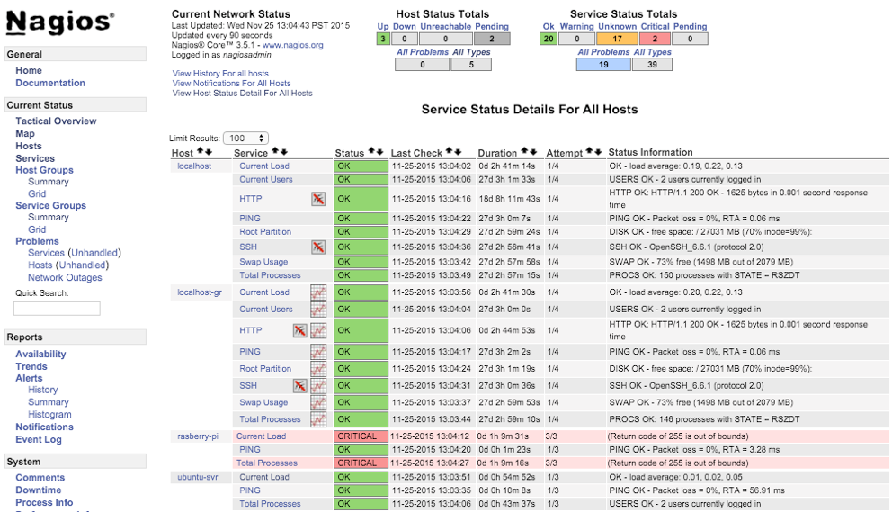


### NCSA vs NRPE

Both NCSA and NRPE enable remote host monitoring with Nagios. This section looks at the advantages and differences.

1. NCSA does passive check. This mean client choses when to send the status to the server. This allowes fine grain control over the update timing and useful for near real time updates
2. NCSA doesn’t require any daemon to be running on the client as the client pushes the update periodically. This leads to simpler install
3. NRPE does active check. The server pulls the info from the client periodically. This is better suited for centrally adminsterored policies.
4. NRPE requires a daemon be runnion on all the clients to service NRPE requests. 
5. NCSA is not in active development anymore. (no updates since 2013)

## Cacti Setup
Duration: 0:20:00

Cacti is performance monitoring tool based on a LAMP stack (Linux/Apache/MySQL/PHP) and RRD (Round Robin Database). It can collect, manage and display graphs of collected data.

### Prerequisites

#### Cacti Dependencies

* Apache : A Web server to display network graphs created by PHP and RRDTool.
* MySQL/MariaDB : A Database server to store cacti information. Recent CentOS versions (7.0 including) use MariaDB as default DB for its LAMP stack)
* PHP : A script module to create graphs using RRDTool.
* PHP-SNMP : A PHP extension for SNMP to access data  (Optional and not required for Solace integration, unless using SNMP from Solace)
* NET-SNMP : A SNMP (Simple Network Management Protocol) is used to manage network. (Optional and not required for Solace integration, unless using SNMP from Solace)
* RRDTool : A database tool to manage and retrieve time series data like CPU load, Network Bandwidth etc.
* UnZip : A simple tool for extracting zip files

### Installation

Installation of Cacti and dependencies is a topic of its own and beyond the scope of this document. There are instructions and materials available that can be readily used. Here are some lnks:

* [The Cacti Manual](https://files.cacti.net/docs/pdf/manual.pdf) 
* [http://www.tecmint.com/install-cacti-network-monitoring-on-rhel-centos-6-3-5-8-and-fedora-17-12/](http://www.tecmint.com/install-cacti-network-monitoring-on-rhel-centos-6-3-5-8-and-fedora-17-12/) 
* [http://www.cacti.net/downloads/docs/html/debugging.html](http://www.cacti.net/downloads/docs/html/debugging.html) 	

### Post Install Setup

This section walks thru the steps to add a sample solace artifiact monitoring to Cacti using web admin. Similar to Nagios, Cacti uses external scripts for gathering the monitoring info. In this example, Queue Depth is used for illustration which can be replaced with any monitoring using right scripts.

#### Add Custom Data Input method. 

Select "Script/Command’ as Input Type and type in the external script name that would collect the metrics from the Solace Event Broker. Note that <path_cacti> is a predefined variable that can be used. The input arguments for the script need to be both declared on the "Input String" and defined in the "Input Fields" section below. Similarly output expected form the script should be defined in the "Output Fields" section. This is used mostly as a placeholder and Cacti doesn’t do any validation on Output Field.

##### Data Input

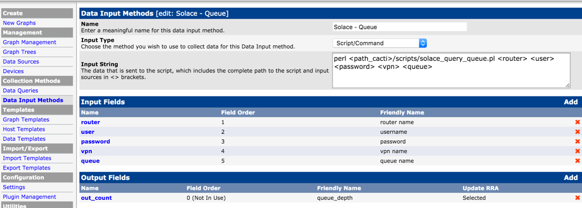

##### Input


##### Output


#### Add Custom Data Template

Using the Data Input method defined above, define a data template for a specifc queue. Use New Data Souce Item to declare info for the specific queue (event broker name, vpn name, queue name and credentials). 


#### Add a custom Graph Template

Now create a Graph Template and associate the Data Template defined earlier with the graph template (using Graph Template Items).


#### Add Solace Event Broker as Device

Now add each event broker as a device so graphs for this event broker can all be grouped under here. This will also allow to run host specific services like ping test.

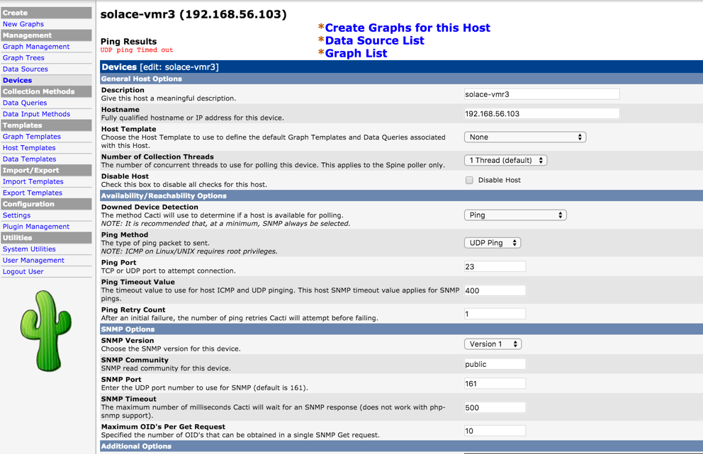

##### Add Data Source List

Use "Data Souce List" link above the Device screen and using "Add" link, add the the endpoint stats here. Also shown here is another data source for ping latency for the event broker. These steps will ensure Cacti will generate the correspoinding RRD files for these resources.


##### Add Graph List

Using "Graph List" link above the device screen, add new graph link by clicking "New" link. Link the Data Source for the specific queue created earlier. This step will ensure graphs are generated from the RRD file using rrdgraph tool

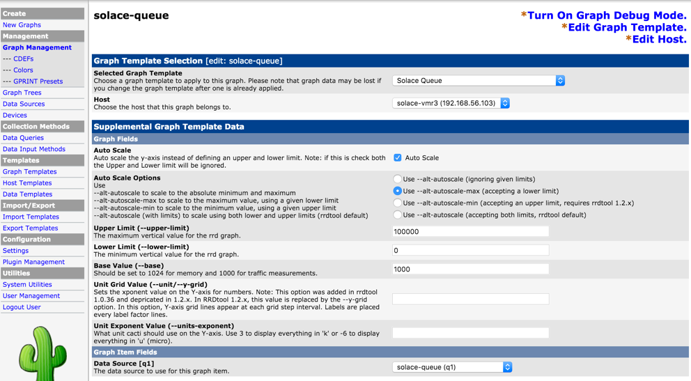

### Verification 

#### Basic Install

Once you have basic Cacti setup up and running, you should be able to access the install and do further configuration thru web admin page at
`http://<your-server-ip>/cacti`

After configuration, you would be able to see basic system metrics for the localhost that would look similar to this

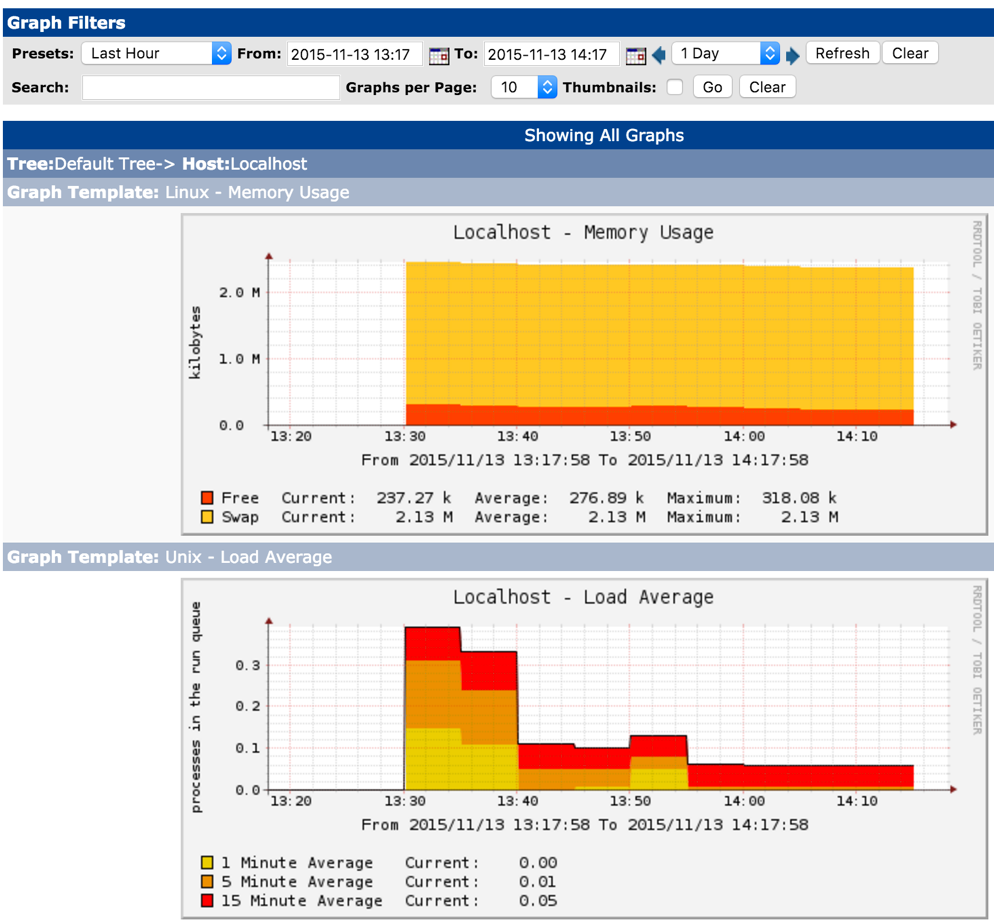

#### Solace host check

Once Solace event broker is added as a device, from he Devices link, you would be able view the event broker with basic health test such as ping status.


#### Solace VPN Metrics Sample

Once VPN artifiact checkings are added, you should be able to view them under Graphs tab. Here is a sample of queue statistics showing queue depth for a single queue on a VPN.

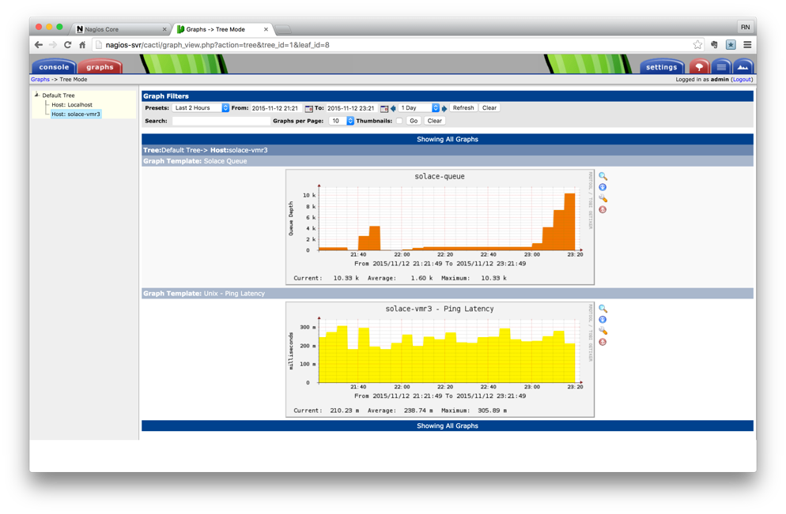

As with any other Cacti graph,  aggrecation over a peroid is  available by clicking on the graph. Here is an example of aggregation of  queue stats over various window period, from hour to year.

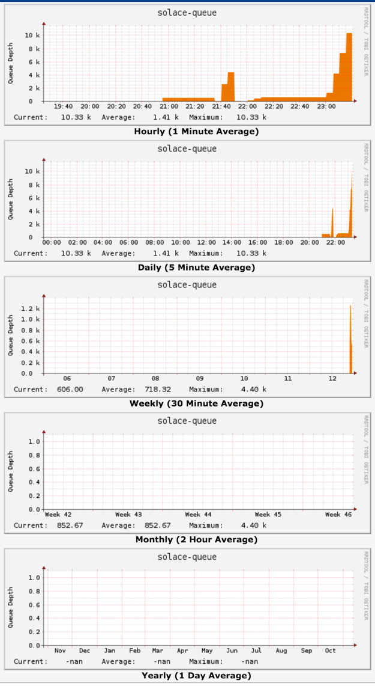

## Additional Topics 
Duration: 0:20:00

### Admin Tasks

#### Creating custom Maps

Create custom maps for any outputs that need it, for example turn the iface counter values into gauge:
Add to /usr/local/nagiosgraph/etc/nagiosgraph/map

```
#######################
# Service type: iface
#   output:IFACE OK - [Interface:1/6/1,Enabled:yes,Link:yes]
#   perfdate: rx-pkts=365832598;; rx-bytes=108312525627;; tx-pkts=390410814;; tx-bytes=363571175913;;
/perfdata:rx-pkts=(\d+);; rx-bytes=(\d+);; tx-pkts=(\d+);; tx-bytes=(\d+);;/
and push @s, [ 'if_stats',
                ['tx-pkts', COUNTER, int $1 ],
                ['rx-pkts', COUNTER, int $2 ],
                ['tx-bytes', COUNTER, int $3 ],
                ['rx-bytes', COUNTER, int $4 ] ];
```

#### Adding additional event brokers / VPNs

Use cfg/samplerouter.cfg as template to create additional event broker, VPN or VPN bridge configuration. Run mk_nagiossolacecfg to generate required solace plugin Config files.

Alternatively, the files can be edited or added in /etc/nagios/objects dir manually. The corresponding entries need to be added into /etc/nagios/nagios.cfg file.

Note that the services need to be restarted for the changes to be effective.

#### Putting Nagios on Verbose mode

Change debug level in Nagios config to 2048

```
# grep ^debug_level  /etc/nagios/nagios.cfg
debug_level=2048
```

Now check the debug logs. All commands executed and output will be logged over there.

```
# tail /var/log/nagios/nagios.debug

[1446670816.003569] [2048.1] [pid=25423] **** BEGIN MACRO PROCESSING ***********
[1446670816.003572] [2048.1] [pid=25423] Processing: '/usr/bin/perl -w /usr/local/nagios/plugins/queue.pl --router $ARG1$ --user $ARG2$ --pass $ARG3$ --vpn $ARG4$ --queue $ARG5$ --warning $ARG6$ --critical $ARG7$ --checkAvail --quiet'
[1446670816.003584] [2048.1] [pid=25423]   Done.  Final output: '/usr/bin/perl -w /usr/local/nagios/plugins/queue.pl --router 192.168.56.103:8080 --user admin --pass admin --vpn vpn2 --queue q5 --warning 100 --critical 1000 --checkAvail --quiet'
[1446670816.003595] [2048.1] [pid=25423] **** END MACRO PROCESSING *************
```

#### Modifying iptables

When you Can't access http from outside or when telnet to server on port 80 fail,
Check Iptables routes:

```
# iptables -I INPUT 5 -i eth0 -p tcp --dport 80  -m state --state NEW,ESTABLISHED -j ACCEPT
# iptables -I INPUT 5 -i eth0 -p tcp --dport 443  -m state --state NEW,ESTABLISHED -j ACCEPT
# iptables-save | tee /etc/sysconfig/iptables
# service iptables save
# service iptables restart
```

### Troubleshooting

#### Nagios not starting up

Check Config file for any errors. 

```
# /usr/sbin/nagios -v /etc/nagios/nagios.cfg
```

#### Can’t connect to HTTP (or other port) from outside

When access to port is working form within the box (for localhost) and not form outside, check the iptables.

#### CGI Error in show.cgi

Check http error.log

```
[Fri May 02 02:21:12 2014] [error] [client 192.168.150.1] (13)Permission denied: exec of '/usr/local/nagios/sbin/show.cgi' failed, referer: http://192.168.150.137/nagios/cgi-bin//status.cgi?host=all 
[Fri May 02 02:21:12 2014] [error] [client 192.168.150.1] Premature end of script headers: show.cgi, referer: http://192.168.150.137/nagios/cgi-bin//status.cgi?host=all
```

* Check file and dir permissions. They should be world readable and executable. 
* Check SE (Security Enhanced Linux)  Mode

```
# chmod go+rx /usr/local/nagios/sbin/
# chmod go+rx /usr/local/nagios/sbin/show.cgi
# setenforce 0

# service  httpd restart
# service  nagios  restart
```

#### CGI Error in Solace graphs

Check that the CGI scripts are runnable from command line. 

Check for missing required modules and Perl libraries.

```
# /usr/local/nagios/plugins/disk.pl -r solace-router:port -u user -p password -v
DISK OK - Disk 1 [State: up, Enabled: true], Disk 2 [State: up, Enabled: true] RAID [in fully redundant state]
```

#### Can’t stat command file error

If you see error
Error: Could not stat() command file ‘/usr/local/nagios/var/rw/nagios.cmd’!

```
# chcon -R -t httpd_sys_script_rw_t /usr/local/nagios/var/rw
(change path based on the error message)
```

## Setup Scripts and Config files
Duration: 0:10:00

This section lists sample config files and setup scripts used in this document. Please check respected product document for most recent syntax for config files.

### Install Info

Default install paths and files

#### HTTP (Apache)

* Config: /etc/httpd/conf/httpd.conf
* Logs: /var/log/httpd/error_log, /var/log/httpd/access_log

#### Nagios

* Config file: /etc/nagios/nagios.cfg
* Commands: /etc/nagios/objects/commands.cfg
* Log: /var/log/nagios/nagios.log
* Perfdata log: /var/log/nagios/perfdata.log
* Config Dir: /etc/nagios/objects
* Command file: /var/spool/nagios/cmd/nagios.cmd

#### RRD

* Data dir: /var/nagios/rrd

#### Nagiosgraph

* Config: /usr/local/nagiosgraph/etc /nagiosgraph.conf
* Apache config: /usr/local/nagiosgraph/etc /nagiosgraph-apache.conf
* Log: /usr/local/nagiosgraph/var/nagiosgraph.log

#### Nagios Solace

* Config: /etc/nagios/solace/solace.cfg
* Plugin dir: /usr/local/nagios/plugins

#### NSCA Daemon and Agent

* Path: /usr/local/nsca/
* Config (server): /usr/local/nsca/cfg/nsca.cfg
* Config (client): /usr/local/nsca/cfg/nsca_server.cfg, /usr/local/nsca/cfg/nsca_client.cfg

### Nagios

This section lists minimal files required for Solace Nagios setup. Please contact [Solace Professional Services](https://solace.com/contact-us/)  to get a tarball package with the files and required plugin files. 

* [setup_nagiossolace.txt](https://github.com/SolaceLabs/solace-integration-guides/blob/master/src/nagios/setup_nagiossolace.txt)
* [mk_nagiossolace.cfg](https://github.com/SolaceLabs/solace-integration-guides/blob/master/src/nagios/mk_nagiossolace.cfg)
* [solace.cfg](https://github.com/SolaceLabs/solace-integration-guides/blob/master/src/nagios/solace.cfg)
* [solace-templaterouter.cfg](https://github.com/SolaceLabs/solace-integration-guides/blob/master/src/nagios/solace-templaterouter.cfg)
* [samplerouter.cfg ](https://github.com/SolaceLabs/solace-integration-guides/blob/master/src/nagios/samplerouter.cfg )
* [vmr2.cfg ](https://github.com/SolaceLabs/solace-integration-guides/blob/master/src/nagios/vmr2.cfg ) 
* [setup_ncsa ](https://github.com/SolaceLabs/solace-integration-guides/blob/master/src/nagios/setup_ncsa )
* [send_ngalert.pl](https://github.com/SolaceLabs/solace-integration-guides/blob/master/src/nagios/send_ngalert.pl )
* [nsca_init](https://github.com/SolaceLabs/solace-integration-guides/blob/master/src/nagios/nsca_init )
* [nsca_cfg](https://github.com/SolaceLabs/solace-integration-guides/blob/master/src/nagios/nsca_cfg )

 
### NRPE

#### Sample server config file

Each client host to be monitored with NRPE should have a config file on the server. Here is a sample config file that should be placed on Nagios objects directory (/etc/nagios/objects by default) on the Nagios server.

This config file does the following checks

* regular host ping check (non NRPE) 
* check users (NRPE)
* check load (NRPE)

```
cat /etc/nagios/objects/nrpe-test1.cfg 

define host{
use generic-host
host_name ubuntu-svr
alias ubuntu
address 192.168.1.108
max_check_attempts 10
}
define service{
use generic-service
host_name ubuntu-svr
service_description PING
check_command check_ping!100.0,20%!500.0,60%
}
define service{
use generic-service
host_name ubuntu-svr
service_description Current Load
check_command check_nrpe!check_load
}
define service{
use generic-service
host_name ubuntu-svr
service_description Total Processes
check_command check_nrpe!check_users
}
```

#### Sample Client Config

```
# cat /etc/nagios/nrpe.cfg
log_facility=daemon
pid_file=/var/run/nagios/nrpe.pid
server_port=5666
nrpe_user=nagios
nrpe_group=nagios
allowed_hosts=127.0.0.1,192.168.56.201,192.168.1.223
 
dont_blame_nrpe=0
allow_bash_command_substitution=0
debug=0
command_timeout=60
connection_timeout=300
command[check_users]=/usr/lib/nagios/plugins/check_users -w 5 -c 10
command[check_load]=/usr/lib/nagios/plugins/check_load -w 15,10,5 -c 30,25,20
command[check_hda1]=/usr/lib/nagios/plugins/check_disk -w 20% -c 10% -p /dev/hda1
command[check_zombie_procs]=/usr/lib/nagios/plugins/check_procs -w 5 -c 10 -s Z
command[check_total_procs]=/usr/lib/nagios/plugins/check_procs -w 150 -c 200 
include=/etc/nagios/nrpe_local.cfg
include_dir=/etc/nagios/nrpe.d/
```