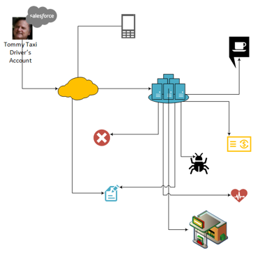
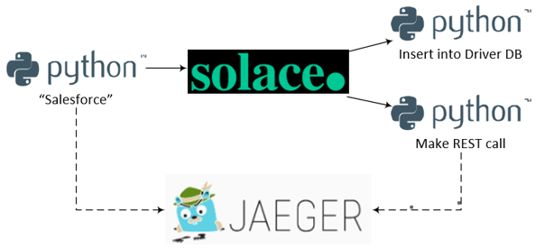
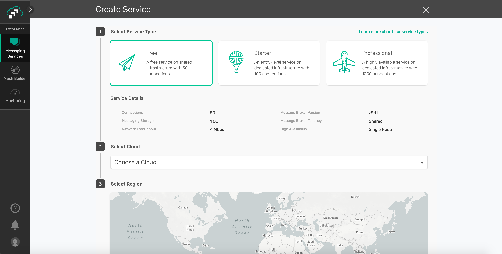
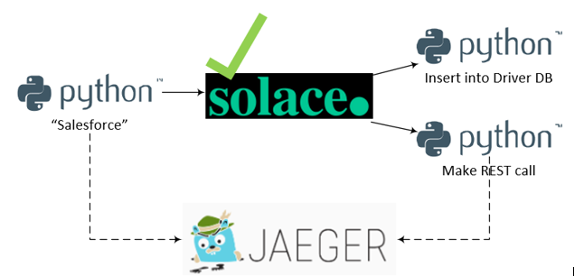
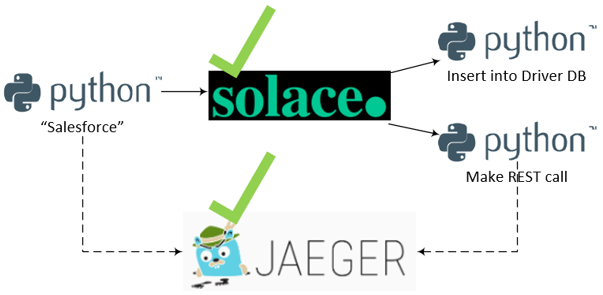
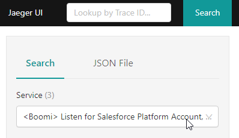
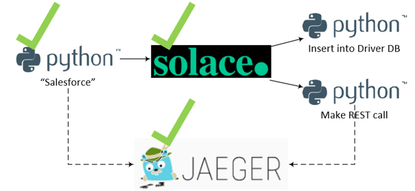
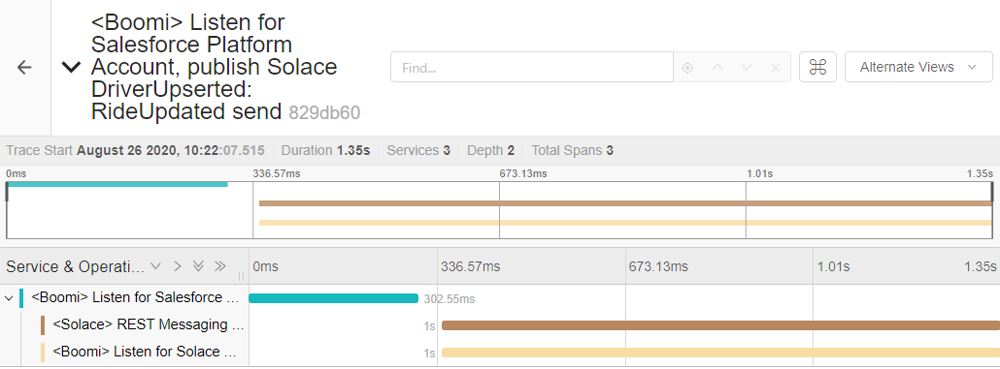

author: Jesse Menning
summary:
id: opentelemetry-intro
tags:
categories: Opentelemetry, Taxi
environments: Web
status: Draft
feedback link: https://github.com/jmenning-solace/nycmoderntaxi/tree/master/opentelemetry-intro

# Using OpenTelemetry to find your event in a haystack

## What you'll learn: Overview

Duration: 0:05:00

Positive
: If you'd like to learn more about OpenTelemetry architecture, but don't care about hands-on stuff, you can find it in my blog post [What is distributed tracing and how does OpenTelemetry work for event-driven integration?](https://solace.com/blog/what-is-distributed-tracing-and-how-does-opentelemetry-work/)

No business likes an angry user. That goes double if the user is a taxi driver. The language can be...intense.

As NYC Modern Taxi Company modernizes its operations through event-based integration, things will go wrong. What's important is that issues are resolved quickly and as painlessly as possible for the end user, so the taxis keep moving. To help with that, NYC Modern Taxi is adding OpenTelemetry distributed tracing to all of their microservices. The goal is to trace events at they move through Solace and potentially dozens of microservices.

Instead of plowing through logs, trying to understand what happened, NYC Modern Taxi can instead search through graphs like these that show how the event moved across microservices:

In this CodeLab you’ll learn about:

✅ How OpenTelemetry works (the basics, if you'd like more detail here is a [solid intro blog post.](https://blog.newrelic.com/product-news/what-is-opentelemetry/))

✅ How to get the Solace PubSub+ Python API, and set up a basic environment.

✅ How to include OpenTelemetry tracing in your processes

✅ How to visualize your event-driven applications with Jaeger

## What you need: Prerequisites

Duration: 0:07:00

1. A general understanding of [event-driven architecture (EDA) terms and concepts](https://docs.solace.com/#Messagin).
1. A free trial account of Solace PubSub+ Cloud. Don't have one? [Sign up here.](https://console.solace.cloud/login/new-account)
1. [Download Jaeger](https://www.jaegertracing.io/download/) for free in the OS of your choosing
1. [Download Python](https://www.python.org/downloads/) for free in the OS of your choosing
1. [Download the sample code](https://github.com/jmenning-solace/nycmoderntaxi/tree/master/opentelemetry-intro) Or use git commands to grab it from [GitHub](https://github.com/jmenning-solace/nycmoderntaxi.git).

Negative
: It's important to note that this CodeLab uses a pre-release version of the Solace PubSub+ Python connector. It has the latest features, but may also have some bugs. [Read more about the Python API.](https://solace.community/discussion/599/pubsub-messaging-api-for-python-v1-0-0-is-officially-ga).

## Use Case Overview 🚕

Duration: 0:03:00

At Solace, we’ve been following the story of NYC Modern Taxi, a taxi company struggling to stay relevant by creating a new ride sharing app. To be clear, it’s a fake company. But its problems are all too real.

At midnight, NYC Modern Taxi went live with the app, and in the morning drivers started complaining about not being able to login. The issue appeared to be with events moving from Salesforce (where potential drivers are recruited) into an operations database used by the mobile application. But given the number of hops the event took along the way, the location of the issue wasn’t exactly clear.

Luckily, to give support personnel better visibility into what's happening at runtime, NYC Modern Taxi added OpenTelemetry to their microservices. In contrast to traditional tracing with line after line of text, distributed tracing shows you a searchable, graphical picture of when, where and how one event flowed through your enterprise. It let NYC Modern Taxi watch the Tommy’s account update zig to the cloud, zag into an on-premises data center, fan out into 40 thanks to a pub-sub architecture, slow down in a bottle neck and then…watch a programming error stop it completely.

Since you can't recreate the whole infrastucture here, you'll focus on a small slice. A "Salesforce" Python script will publish a message to Solace. That message will be consumed by two additional Python scripts, one playing the role of an outbound REST call, the other mocking a database insert. Each process sends a trace to Jaeger, which both collects them and displays in pretty, useful pictures.

## Set up a Solace PubSub+ Broker

Duration: 0:05:00

Access to a Solace messaging service, Solace PubSub+, can be achieved in either one of the three flavours

1. Hardware Appliance
1. Software broker image (Docker, Virtual image)
1. Solace Cloud service instance

This tutorial will walk you through setting up a Solace Cloud service instance, which also gives you access to the Event Portal. If you are interested in setting up a local broker running on Docker or a virtual machine check out the [PubSub+ Event Broker: Software](https://docs.solace.com/Solace-SW-Broker-Set-Up/SW-Broker-Image-Setup.htm) documentation

### Sign up for free Solace Cloud account

Navigate to the [Create a New Account](https://console.solace.cloud/login/new-account) page and fill out the required information. No credit card required!

### Create a messaging service

After you create your Solace Cloud account and sign in to the Solace Cloud Console, you'll be routed to the event mesh page.

Click on 'Messaging Services' and all the messaging services associated with your account will show up if you have any already created. To create a new service, click either button as depicted in the image below:

Fill out all the details for your messaging service, and then click "Create" at the bottom of the page.

Your service should be ready to use in a couple seconds! 🌪

Click on the previously created service and navigating to the **Connect** tab.
Expand the "Solace Messaging" menu to get the connection details

Use a text editor to save the the connection parameters with the **Host**, **Message VPN Name**, **Client Username** and **Password**. You'll need them later.

✔️ You've created the first part of the solution!

## Set up Jaeger All-In-One

Duration: 0:05:00

Jaeger collects and visualizes the spans created by your microservices. It has several different components such as an underlying database, a GUI and a span collector, but fortunately it has an all-in-one distribution that makes setup easy.

Negative
: If you don't have a tool that opens .gz files, you can download one. [7-Zip](https://www.7-zip.org/download.html) is a good free option

### Steps to install

1. Extract the Jaeger distribution file you downloaded as part of the prerequisites. (e.g. `jaeger-1.17.1-windows-amd64.tar.gz` on Windows)
1. Open a command terminal.
1. Run `jaeger-all-in-one`
1. Using a web browser, navigate to `http://localhost:16686/`
1. You should be greeted by a picture of a...chipmunk? Gopher? Not really sure.

Negative
: You'll need to keep the terminal window running Jaeger open. If you close it, you'll lose the traces you've collected.

✔️ You've created the second part of the solution!

## Set up Python environment

Duration: 0:12:00

Python is a great language for prototyping applications. It's easy to get up and running quickly, and since it doesn't compile you just change a line and reload. This CodeLab uses Python to simulate Salesforce publishing the message and two event consumers using the [Solace PubSub+ Python API](https://solace.community/discussion/599/pubsub-messaging-api-for-python-v1-0-0-is-officially-ga). And since there is a native OpenTelemetry API for Python it can produce the OpenTelemetry tracing as well.

### Steps to install

1. Open the Python installer that you downloaded in the prerequisites.
1. You'll be guided through the install process.

Positive
: Be sure to include Python in your PATH variable as per the download instructions

Once it's complete, you should have a program called IDLE (Integrated Development and Learning Environment).

That's what you'll use to modify and run the Python scripts.

## Create the "Salesforce" message publisher

Duration: 0:10:00

Positive
: This CodeLab focuses on OpenTelemetry, so it won't actually implement the Salesforce events. If that's your passion, Solace has a great [CodeLab about event-enabling Salesforce with Boomi and Solace](https://codelabs.solace.dev/codelabs/boomi-salesforce-codelab/). Likewise, this CodeLab doesn't get into the nitty gritty of the Python API. If you want to know more about those capabilities, there will be a CodeLab soon.

1.  If you haven't already, unzip the CodeLabs code into a convenient directory
1.  Open a terminal window and navigate to the downloaded github repo
1.  Configure a virtual Python environment

        python -m pip install --user virtualenv
        python -m venv venv
        ## Activate the virtual environment on MacOS
        source venv/bin/activate
        ## Activate the virtual environment on Windows
        source venv/Scripts/activate

1.  Install the required OpenTelemetry dependencies with pip

        pip install -r requirements.txt

1.  Execute the `solace_telemetry_publisher_Salesforce.py` by passing the correct environment variables

        SOLACE_HOST=<host_name> SOLACE_VPN=<vpn_name> SOLACE_USERNAME=<username> SOLACE_PASSWORD=<password> python solace_telemetry_publisher_Salesforce.py

1.  If it's successful, you'll get a message like:

        2020-08-26 08:33:41,885 [INFO] pysolace.messaging.core: solace_session.py:470  ESTABLISH SESSION ON HOST tcp://mr-d8f4yze27kt.messaging.solace.cloud:55555
        parentSpan trace_id  on sender side:18915100849980568506040033268233107768
        parentSpan span_id  on sender side:16251617562995641485
        Process finished with exit code 0

1.  To check out the trace you generated (which only has one span in it at this point), open up the [Jaeger UI](http://localhost:16686/search).
1.  You should see a service listed with the name: `<Boomi> Listen for Salesforce Platform Account, publish Solace DriverUpserted`

1. Click on the "Find Traces" button on the bottom of the left-hand column.

1. In the results, you should see the trace of the microservice, which should contain one span.
   

✔️ You've created the third part of the solution!

### Code Walk Through (optional)

1.  The code creates a trace factory, using the default TracerProvider. The code creates the actual tracer later on using this factory.
1.  The we create the Jaeger exporter, which contains the details on how to connect to Jaeger. As you can see, it's running locally on port 6831.

        trace.set_tracer_provider(TracerProvider())
        jaeger_exporter = jaeger.JaegerSpanExporter(
        	service_name="<Boomi> Listen for Salesforce Platform Account, publish Solace DriverUpserted",
        	agent_host_name="localhost",
        	agent_port=6831,
        )

1.  Now that there is connectivity to Jaeger, the code specifies that the spans we create will be send in batches using the BatchExportSpanProcessor.

        trace.get_tracer_provider().add_span_processor(
        BatchExportSpanProcessor(jaeger_exporter)

1.  Using the trace factory that you created above, you get an instance of a trace, called tracer. Using tracer, you create a span, which describes what happens in this microservice.

        tracer = trace.get_tracer(__name__)
        # THIS IS PER https://github.com/open-telemetry/opentelemetry-specification/blob/master/specification/trace/semantic_conventions/messaging.md
        parentSpan = tracer.start_span(
        	"RideUpdated send",
        	kind=SpanKind.PRODUCER,
        	attributes={
        		"messaging.system": "solace",
        		"messaging.destination": "RideUpdated send",
        		"messaging.destination-kind": "topic",
        		"messaging.protocol": "jcsmp",
        		"messaging.protocol_version": "1.0",
        		"messaging.url": "url of solace box"}
        )

1.  Now that the span is established, you need to get the span's trace_id and the span_id

        trace_id = parentSpan.get_context().trace_id
        span_id = parentSpan.get_context().span_id`

1.  As the script publishes the event, it includes the trace id and the span id as two headers in the message. Downstream consumers now have access to them.

        outbound_msg = OutboundMessage.builder() \
        	.with_property("trace_id", str(trace_id)) \
        	.with_property("span_id", str(span_id)) \
        	.build("Hello World! This is a message published from Python!")

1.  Finally, end the parentSpan, so it will be sent to Jaeger

        parentSpan.end()

## Create the message consumers

Duration: 0:10:00

Now that "Salesforce" is publishing an event to Solace, you need to get the "REST" consumer and the "database" consumers up and running. It's basically the same procedure as before.

1.  In a new terminal, navigate to the directory where the code resides
1.  Activate your virtual environment by executing `source venv/bin/activate` in MacOs or `source venv/Scripts/activate` on Windows
1.  Execute the `solace_telemetry_publisher_Salesforce.py` by passing the correct environment variables

        SOLACE_HOST=<host_name> SOLACE_VPN=<vpn_name> SOLACE_USERNAME=<username> SOLACE_PASSWORD=<password> python solace_telemetry_consumer_Database.py

1.  You should see something like:

        2020-08-26 08:32:20,449 [INFO] pysolace.messaging.core: [solace_session.py:470]  ESTABLISH SESSION ON HOST [tcp://mr-d8f4yze27kt.messaging.solace.cloud:55555]
        Execute Direct Consume - String
        Subscribed to: opentelemetry/helloworld

1.  The database consumer listens for incoming message until it receives a keyboard interrupt. At that point you'll see a message that says:
    Process finished with exit code 0

🔁 Repeat this process with `solace_telemetry_consumer_REST.py`, so you have two consumers running at the same time.

Negative
: Don't forget to activate your Python virtual env in the new terminal you open!

✔️ You've created the entire solution!

### Code Walk Through (optional)

Much of the code here is either:

- The same as the publisher, for instance the boilerplate code needed to get a trace factory, get connectivity to Jaeger and close the span once the work is done
- Code needed to establish and keep the connection to the Solace broker

We'll focus on what's different, which is mainly extracting the span_id and trace_id from the incoming message and using them to start a new span, specifying the publisher's span as the parent span.

1.  When an event arrives on the `telemetry/helloworld` topic, the `direct_message_handler(msg)` function is called.
1.  The function first extracts the span id and the trace id from the event

        trace_id = str(msg.get_property("trace_id"))
        span_id = str(msg.get_property("span_id"))
        print("parentSpan trace_id on receiver side:" + trace_id)
        print("parentSpan span_id on receiver side:" + span_id)

1.  Using the span_id and trace_id, it then recreates the pubisher's context

        propagated_context = SpanContext(int(trace_id), int(span_id), True)

1.  Using the recreated context, it then opens a new span, specifying the parent span as the publisher. This allows the linkage between the publisher and the consumer.

        childSpan = tracer.start_span("RideUpdated receive", parent=propagated_context)

## Run an end-to-end test

Duration: 0:10:00

Now all the pieces are in place. To see the end-to-end solution:

1.  Run the two consumers in two separate terminal instances
1.  Run the publisher in another terminal instance
1.  As soon as you run the publisher, you should see a log entries in each of the consumers showing that the events were received. The logs should look like:

        CALLBACK: Message Received on Topic: opentelemetry/helloworld.
        Message String: Hello World! This is a message published from Python!

        parentSpan trace_id on receiver side:18915100849980568506040033268233107768
        parentSpan span_id on receiver side:16251617562995641485

1.  Head back to the [Jaeger UI](http://localhost:16686/search) one more time.
1.  You should see still a service listed with the name: `<Boomi> Listen for Salesforce Platform Account, publish Solace DriverUpserted`), click on the "Find Traces" button again to make sure you have the latest results.
1.  There should be a result that include all three spans that you created
    

1.  Clicking on the result gives you a Flame Graph, showing exactly how long each process took and how the processes are related
    

## Takeaways

Duration: 0:02:00

✔️ With Event-driven integration, real-time data can reach across your enterprise faster
✔️ Event-driven integration also loosely couples publishers and consumers of information, which let's you create innovative solutions faster
✔️ But that loose coupling means that you need to think carefully about how to trace events going through your enterprise
✔️ OpenTelemetry gives you visibility into the movement of events

Thanks for participating in this codelab! Let us know what you thought in the [Solace Community Forum](https://solace.community/)! If you found any issues along the way we'd appreciate it if you'd raise them by clicking the Report a mistake button at the bottom left of this codelab.
